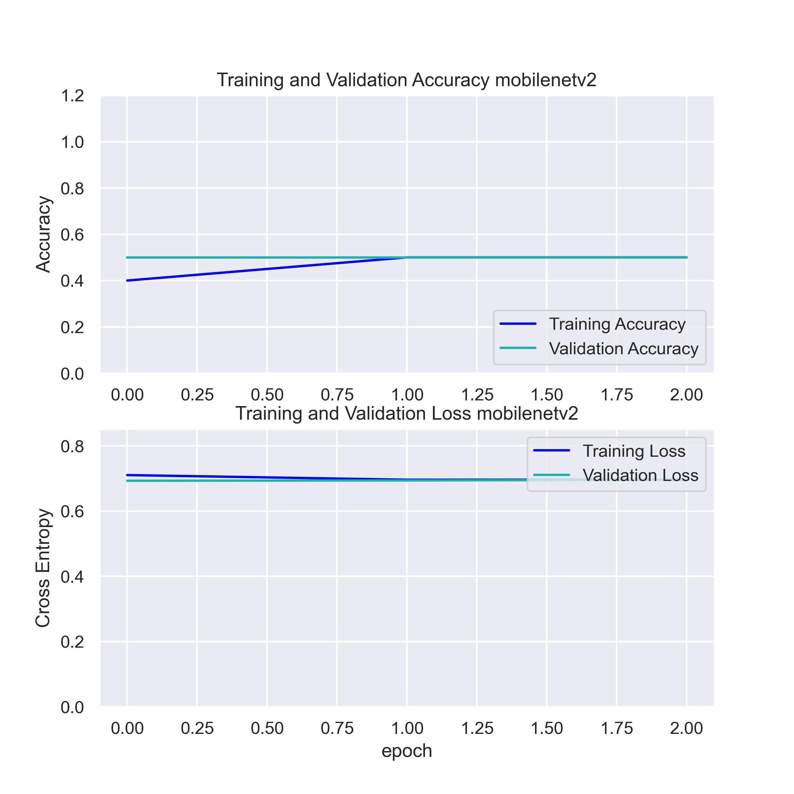
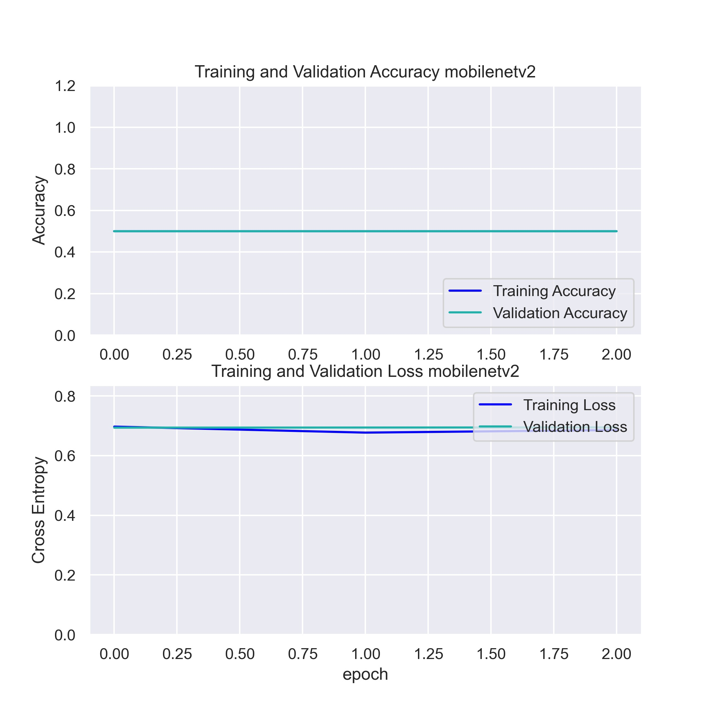
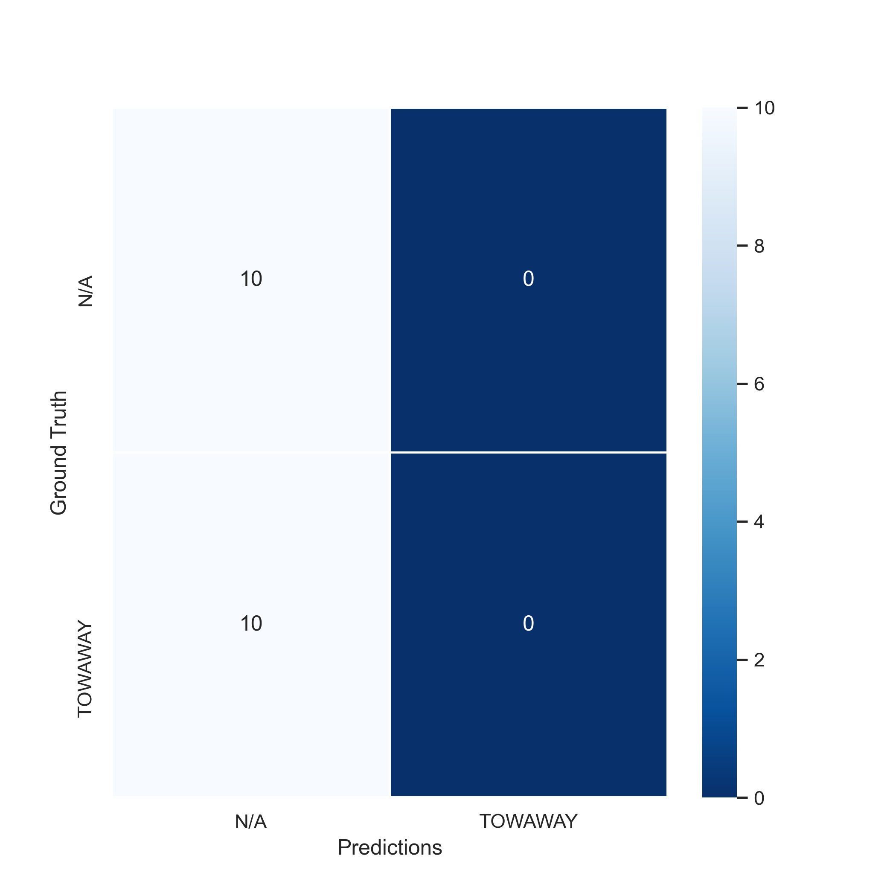
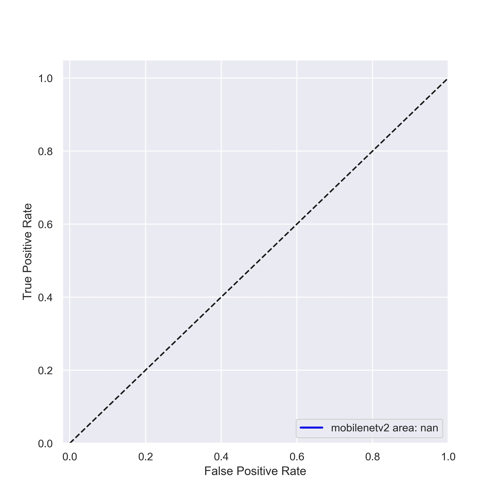

Mobilenetv2 Results
===================
  
### Training And Validation Results [1]

  
### Classification Report [1]

```
              precision    recall  f1-score   support

         N/A       0.50      1.00      0.67        10
     TOWAWAY       0.00      0.00      0.00        10

    accuracy                           0.50        20
   macro avg       0.25      0.50      0.33        20
weighted avg       0.25      0.50      0.33        20

```  
### Confusion Matrix [1]

  
### Roc Curve [1]

  
### Training And Validation Results [2]

  
### Classification Report [2]

```
              precision    recall  f1-score   support

         N/A       0.50      1.00      0.67        10
     TOWAWAY       0.00      0.00      0.00        10

    accuracy                           0.50        20
   macro avg       0.25      0.50      0.33        20
weighted avg       0.25      0.50      0.33        20

```  
### Confusion Matrix [2]

  
### Roc Curve [2]



`Average Loss: 0.69771  |  Average Accuracy: 0.50000`